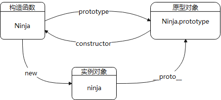
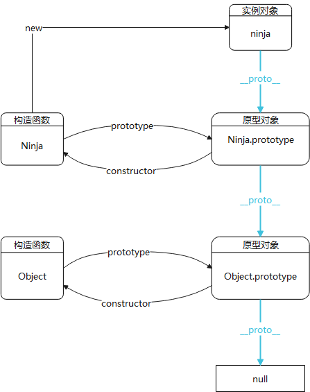
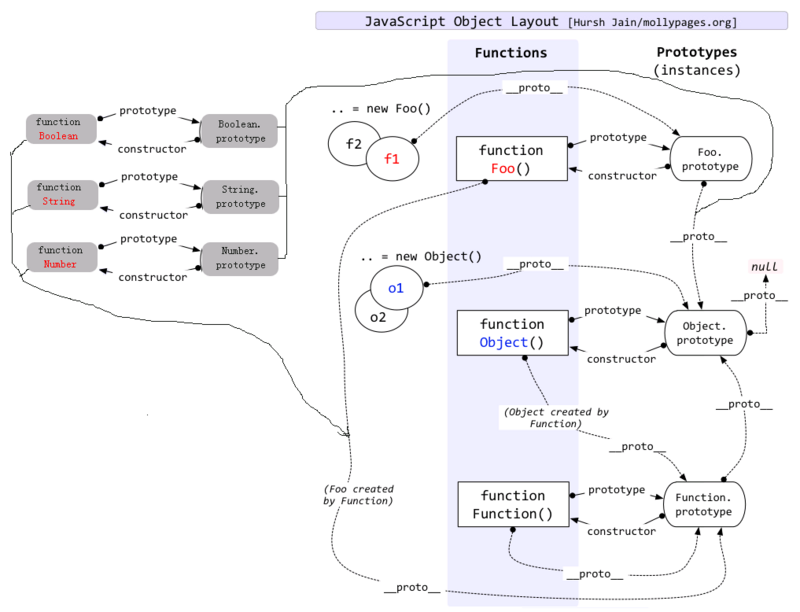
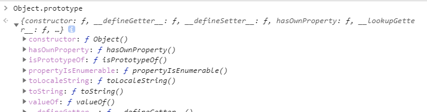
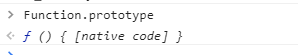

# 一、原型  
我们先看一个基础的例子，通过构造函数新建一个实例。
```js
function Ninja = fucntion() {
    this.swung = false;
}
Ninja.prototype.swingSword = function () {
    this.swung = true;
}
var ninja = new Ninja();
```
在说原型之前有几个基础概念需要了解:
1. 构造函数：用来初始化新对象的函数，这里`Ninja`函数就是构造函数。
2. 实例对象：通过构造函数new操作新建的对象，这里`ninja`就是实例对象。
3. 构造过程：`new Ninja()`; 创建一个空对象{}，将此空对象作为上下文，传给`Ninja`函数，最后赋给`ninja`。所以，函数作为构造器调用时，其上下文是这个新建的对象，this指向它。
4. `prototype`：原型对象是在 **调用`new Ninja()`** 时创建的，构造函数有一个 `prototype`属性，原型对象最后会被关联到这个`Ninja.prototype`上。**通过同一个构造函数新建的不同实例对象，他们的原型对象是相同的，可以让所有实例对象共享原型对象包含的属性和方法**。原型对象中`construct`和`__proto__`两个属性会被自动创建，经常使用原型对象来实现继承。
5. `constructor`：原型对象有个constructor属性，指向该原型对象的构造函数。由于实例对象可以继承原型对象的属性，所以实例对象也有constructor属性，也指向原型对象对应的构造函数。
6. `__proto__`：js在创建对象（不论是普通对象还是函数对象）时，都有一个叫做`__proto__`的内置属性，**指向构造函数的原型对象**，并从原型对象**继承属性和方法**。也可以用`Object.getPrototypeOf(实例对象)`来查看原型对象内容。  

>`__proto__`是站在对象的角度讨论原型对象，指向构造函数的原型对象。(每个对象都有这个隐式属性)  
`prototype`是站在构造函数的角度讨论原型对象。(每个函数都有这个属性)  

有上面概念，我们就很容易画出构造函数、原型对象、实例对象间的关系。  



## 原型链
>前面理清了构造函数、原型对象、实例对象间的关系。当我们要查找一个实例对象的属性时，会先查找构造过程中创建的私有属性，然后查找原型对象（`ninja.__proto__`）上的公有属性。如果都没找到，那接下来呢？  

我们知道原型也是对象，既然是对象，那么它也有对应的原型，所要查找的属性会继续在ninja原型的原型上查找，直到终点`Object.prototype`。这样形成一个链条，称之为原型链。下图中蓝色__proto__线即为原型链走向。  


## Function和Object之间的纠缠  
> `instanceof`运算符：`A instanceof B`判断B构造函数的原型（即`B.prototype`）是否在A的原型链上。


`Object`和`Function`本身都是对象，所以继承了`Object.prototype`
```js
Object instanceof Object // true
Function instanceof Object // true Function继承了Object.prototype
```
`Object`和`Function`本身都是构造函数，所以继承了`Function.prototype`  
```js
Object instanceof Function // true Object继承了Function.prototype
Function instanceof Function // true
```
从上面例子来看，这里就有个疑问，Object和Function难道是相互继承的？其实并不是，下图为原型链经典图。
   

### Object.prototype
我们先把打印`Object.prototype`打印出来看看是个什么。  
   
可以看到他是一个拥有`toString`等公共属性和方法的**对象**。

>我们不妨做一个猜想：`Object.prototype`从哪来和干啥的？  
`Object.prototype`为Object的原型对象，如果把它看做普通对象，那正常来说对象应该是通过`Object`构造函数创建。  
就会产生这种等式：`Object.prototype.__proto__ === Object.prototype`。这会产生循环引用，显然不合理。  

当我们尝试将`Object.prototype`的原型对象打印出来，发现是`null`。这进一步说明了它不是由Object创建的。
```js
Object.prototype.__proto__ === null
```
#### 那它是如何生成的？
>其实`Object.prototype`是浏览器底层根据ECMAScript规范创建的一个对象，并不是由Object创建。  

#### 那它是干啥的？
>上图中可以看出`Object.prototype`为所有对象**原型链的终点**（不包含null），**所有对象从它继承了`toString`等公共属性和方法**。  

### Function.ptototype  
同样我们先打印看看`Function.ptototype`是什么。  
   
**WTF???** 跟预期中是个对象不一样啊，它竟然是个函数。  

我们看看**ES5规范**对`Function.ptototype`的描述：
>The Function prototype object is itself a Function object (its [[Class]] is "Function") that, when invoked, accepts any arguments and returns undefined.  
Function.prototype是一个函数对象，它的内部属性`[[class]]`为`function`，当它作为函数被调用时，接受任意参数，并返回`undefined`。  

虽然规范给出了定义，但是没有解释为什么会是这样。我找了一些资料[What is Function's __proto__?](https://stackoverflow.com/questions/7688902/what-is-functions-proto)，这里面写到，这可能仅仅是为了统一，因为所有的构造函数都像这样。比如：  
- `Object.prototype` 是一个Object对象。
- `Function.prototype` 是一个Function对象，在调用时返回undefined。
- `Array.prototype` 是一个空的Array对象。
- `String.prototype` 是一个String对象，其值为空String。
- `Boolean.prototype` 是一个 bool(boolean) 对象，其值为false。
- `Number.prototype` 是一个Number对象，其值为+0。
- `Date.prototype` 是一个Date对象，其[[PrimitiveValue]]为NaN。
- `RegExp.prototype` 是一个RegExp对象，其数据属性类似于new RegExp()的数据属性。
- `Error.prototype` 是一个错误对象。  

我们把它当成一种标准就行了，也没必要深究。  

#### 那它是如何生成的？  
```js
// 普通函数继承于Function
function a() {}
a.__proto__ === Function.prototype // true
a.prototype // { constructor: f a(), __proto__: Object }

// 表达式1
Function.prototype.__ptoto__ === Object.__proto__ // true
// 表达式2
Function.prototype.prototype === undefined // true
```
`Function.prototype`虽然是函数对象，但是它于普通函数并不一样。
1. 普通函数是`Function`的实例，继承于`Function.prototype`；从上面表达式1可看出：`Function.prototype`是**直接继承于`Object.__proto__`**。
2. 普通函数作为构造函数时，会有一个空的原型对象; 从上面表达式2可看出，而`Function.prototype`**没有原型对象**。  

简言之`Function.prototype`是一个特殊的函数对象，其`__proto__`属性指向 `Object.prototype`，**即`Function.prototype`会直接继承`Object.prototype`**。

#### 那它是干啥的？
`Function.prototype`为**所有function的原型**（包含Function自己），为所有函数提供了call、bind、apply等公共属性和方法。

### 小结
所以现在我们可以解释上面的问题，为什么`Object instanceof Function`和`Function instanceof Object`都为`true`。
1. `Object`作为构造函数，继承于`Function.prototype`，所以`Object instanceof Function === true`。
2. `Function`作为构造函数，继承于`Function.prototype`,而`Function.prototype`又继承于`Object.prototype`，所以`Function instanceof Object === true`。  

通过这点，我们可以**进一步弄清楚原型链**：  
**null <- Object.prototype(root) <- Function.prototype <- Function|Object|Array等构造函数。**  

- `Object.prototype`是浏览器底层根据 ECMAScript 规范创造的一个对象。   
- `Function.prototype`直接继承的`Object.prototype`，同样它也是由是引擎创建出来的函数，引擎认为不需要给这个函数对象添加`prototype`属性。`Function.prototype.prototype`为`undefined`。  
- 先有`Object.prototype`（原型链顶端），`Function.prototype` 继承 `Object.prototype` `而产生，最后，Function` 和 `Object` 和其它构造函数继承 `Function.prototype` 而产生。


# 类与继承
## new做了什么  
1. 在内存中新建一个空对象
2. 该对象内部的`[[prototype]]`指向构造函数的原型对象
3. 构造函数内部的`this`指向该对象
4. 执行构造函数代码（给该对象添加属性）
5. **注意**：如果构造函数返回非空对象，则返回该对象；否则返回创建的对象
### new的实现  
```js
function _new(fn) {
  if(typeof fn !== 'function') {
    console.error('参数错误')
    return
  }
  // 1. 创建新对象
  const obj = new Object()
  const args = Array.slice.call(arguments, 1)
  // 2. 绑定原型对象
  obj.__proto__ = fn.prototype
  // 3. 修改this指向，执行构造函数
  const result = fn.apply(obj, args)
  // 4. 根据结果返回
  return result instanceof Object ? result : obj
}
```
>也可以简化，`Object.create()`：创建一个新对象，用现有对象来提供新创建的对象的`__proto__`。

```js
function _new(fn, ...args) {
  if(typeof fn !== 'function') {
    console.error('参数错误')
    return
  }
  const obj = Object.create(fn.prototype)
  const result = fn.apply(obj, args)
  return result instanceof Object ? result : obj
};
```
> 所以，构造函数千万不要有返回值。  

从es5到es6，类的继承形式上发生了很大的变化。如今来梳理一下。

### 二、es5的继承

es5的继承基于原型链，子类的原型对象指向父类的实例，以继承父类所有属性及方法。
```js
function Super () {
    this.superFlag = true;
};
Super.prototype.getSuper = function () {
    return this.superFlag;
}
//1. 构建子类
function Sub () {
    Super.call(this);   //继承属性, 同样可以传参
    this.subFlag = false;
}
Sub.prototype.getSub = function () {
    return this.subFlag;
}
//2. 修改原型,使Sub能使用Super的属性及方法
Sub.prototype = new Super();

// 更建议使用Object.create(),无副作用.创建一个新对象,并把新对象的__proto__关联到你指定的对象
// Sub.prototype = Object.create(Super.prototype)

// es6之后可用Object.setPrototypeOf()来修改关联
// Object.setPrototypeOf(Sub.prototype, Super.prototype)


// + 修改constructor指向
Sub.prototype.constructor = Sub;

var sub = new Sub();
console.log(sub.superFlag);  //true
console.log(sub.getSuperFlag);  //[Function]
```

但是上面还有个小问题，Sub.prototype = new Super(); 这里会导致Sub.prototype.constructor会指向Super构造器，所以需要重新将constructor指向Sub。

### 三、es6的继承
ES5是在子类创建this，将父类的属性方法绑定到子类，es6的继承机制跟es5有所不同，ES6继承是在父类创建this对象，在子类constructor中来修饰父类的this（所以必需要调用super()函数）。
```js
class Super{
	constructor(flag) {
		this.flag = flag;
	}
	getSuper() {
		return this.flag;
	}
}
class Sub extends Super{
	constructor(flag, subFlag) {
		super(flag);
		this.subFlag = subFlag;
	}
	getSub() {
		return this.subFlag
	}
}

var sub = new Sub('super', 'sub');
console.log(sub.flag)           //super
console.log(sub.getSuper())     //super
console.log(sub.subFlag)        //sub
console.log(sub.getSub())       //sub
```
其中有几个关键点：  

#### constructor方法
constructor方法是默认的方法，在new一个对象的时候自动调用该方法，如果没有则会自动添加一个。
#### super关键字
- super关键字当做函数使用


    super当做函数使用时，代表父类的构造函数。子类的构造函数必须执行一次super函数。  
    
    如上例，Sub中，super()函数虽然代表父类构造函数Super，但返回的是子类Sub的实例，即super内部的this指向的是Sub，因此这里的super()相当于：Super.prototype.constructor.call(this) 
    
    注意：作为函数时，super只能在子类的构造函数中使用，其他地方使用会报错。  

- super作为对象使用  

super作为对象使用时，在普通方法中，指向父类的==原型对象==，在静态方法中，指向父类。 

```js
class A {
  constructor() {
    this.p = 2;
  }
  getA() {
  	return this.p;
  }
}
A.prototype.x = 3;

class B extends A {
  get m() {
  	return super.p
  }
  get n() {
  	return super.getA;
  }
  get l() {
    return super.x;
  }
}

let b = new B();
console.log(b.m);	//undefined
console.log(b.n);	//[Function: getA]
console.log(b.n()); //2
console.log(b.l);   //3
```
由于super指向原型对象，所以只能访问定义在父类原型对象上的属性，而不能访问定义在父类实例上的方法或属性。(即不能访问构造器函数里面定义的属性)  
注意：ES6规定，通过super调用父类方法时，方法内部的this指向子类。如下：
```js
class A {
  constructor() {
    this.x = 1;
  }
	getA() {
		console.log(this.x);
}
}

class B extends A {
  constructor() {
    super();
    this.x = 2;
    super.getA();  // 2
    
  }
}

let b = new B();

```

#### 类的__proto__、prototype
class作为构造函数的语法糖，同时有\__proto__和prototype属性。
1. 子类的__proto__属性，表示构造函数的继承，总是指向父类。
2. 子类prototype属性的__proto__属性，表示方法的继承，总是指向父类的prototype属性。  


