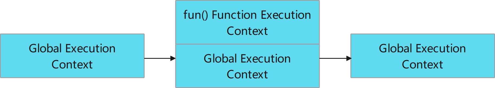
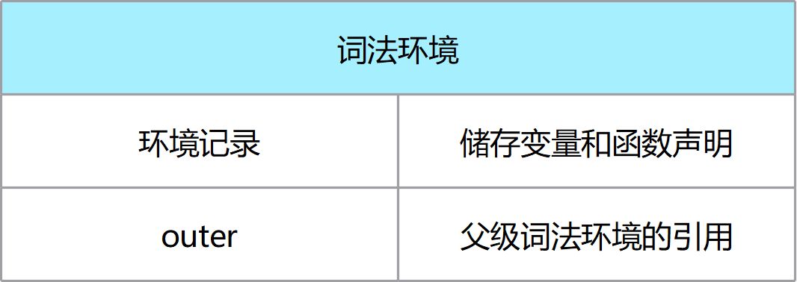
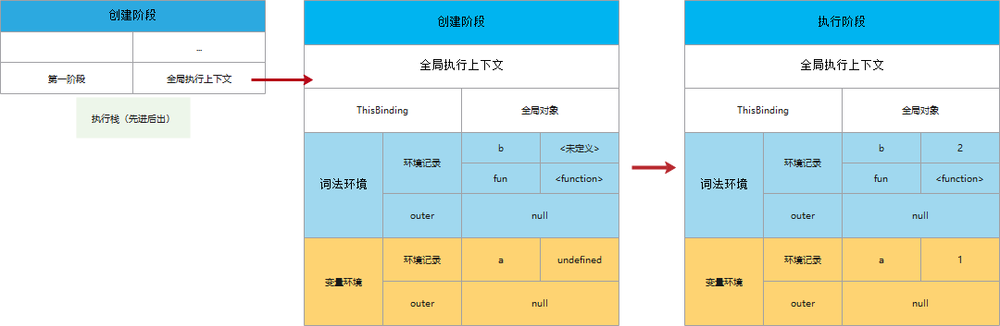
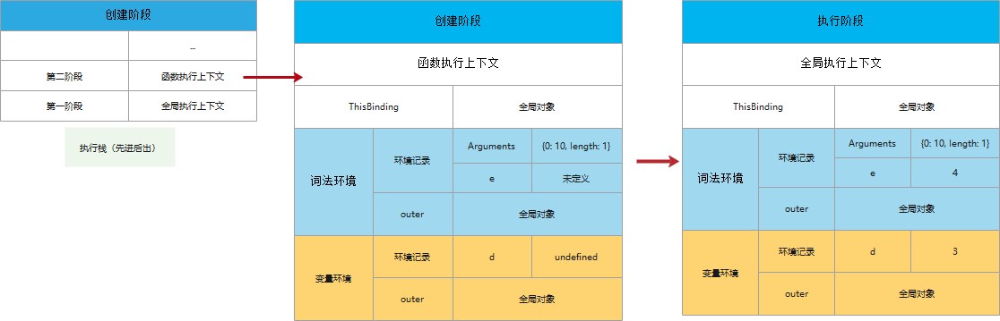

# 什么是执行上下文  
执行上下文就是当前 JavaScript 代码被解析和执行时所在环境的抽象概念， JavaScript 中运行任何的代码都是在执行上下文中运行，包含了当前调用的所有信息。简言之 **执行上下文就是 JavaScript 执行一段代码块时的运行环境** 。 


## 执行上下文何时产生
任何JavaScript代码片段在执行前都要进行编译，然后做好执行它的准备，并且通常会马上执行它。执行上下文就是在代码编译阶段产生的。  

    编译过程：
    1. 分词/词法分析：程序分解为词法单元
    2. 解析/语法分析：形成抽象语法树
    3. 代码生成：转化为可执行代码  


## 执行上下文类型 
根据代码不同的运行场景，执行上下文有不同类型。  
- 全局执行上下文：默认上下文，当代码运行时，JavaScript 引擎首先创建一个全局执行上下文来执行全局代码。他会做两件事，创建一个全局对象window（浏览器），并且设置this指向window。
- 函数执行上下文 - 每个函数被调用，都会创建自己的上下文，来执行该函数代码。
- eval执行上下文 - eval也有自己的上下文。（尽量不使用）

## 执行栈
一段常见的JavaScript代码会有全局代码和多个函数，对应的就会有一个全局执行上下文和多个函数执行上下文，那么js引擎又是如何管理这些执行上下文的呢？  

    执行栈，它是一种用来管理执行上下文的数据结构，遵循 LIFO（后进先出） 原则。
步骤：  
1. js引擎首次读取脚本时，它会编译代码，创建全局上下文，并压入栈底。
2. 每当有一个函数调用，引擎会编译代码，为该函数创建一个新的执行上下文，并压入栈顶。
3. 引擎会执行栈顶上下文中的可执行代码，当执行结束后，该执行上下文从栈中弹出，js引擎控制流程到下一个执行上下文，直到全局代码被执行完。
```js
const a = 100
function fun(b) {
  return a * b
}
const c = fun(2)
```


# 执行上下文如何创建
上文从**宏观**层面介绍了什么是执行上下文，它是在何时被创建的，以及如何管理它们。现在让我们从**微观**角度看JavaScript引擎是如何创建上下文的。

    JavaScript如今已经迭代了多个版本，执行上下文的创建也不尽相同。
## es3规范上下文生命周期
- 创建阶段  
  1. 创建作用域链    
  2. 创建变量对象，用当前函数的参数列表(arguments)初始化一个“变量对象”并将当前执行上下文与之关联，并且，函数代码块中声明的变量和函数将作为属性添加到这个变量对象上(即变量声明提升)。
  3. this绑定
- 激活/执行阶段  
代码逐行开始执行，有对定义的变量赋值、顺着作用域链访问变量如果内部有函数调用就创建一个新的执行上下文压入执行栈并把控制权交出等操作。
- 销毁阶段    
当函数执行完成后，当前执行上下文会被弹出执行上下文栈并且销毁，控制权被重新交给执行栈上一层的执行上下文。

## es6规范上下文生命周期

- 创建阶段  
  1. this绑定
  2. 创建**词法环境**
  3. 创建**变量环境**
- 激活/执行阶段  
完成变量分配，执行代码。
- 销毁阶段  
上下文弹出销毁，进入下一个上下文。  

# es6执行上下文详解  
    ES6对ES3中的部分概念进行了修改，去掉了变量对象、活动对象和作用域，变为了词法环境(lexical environment)和变量环境(variable environment)。  
```js
ExecutionContext = {
  ThisBinding,
  LexicalEnvironment,
  VariableEnvironment,
}
```

## 词法环境（Lexical Environment）
    词法环境是一种规范，用于在 ECMAScript 代码的词法嵌套结构中定义标识符、特定变量以及函数的关联。  
简单来说词法环境是一种持有**标识符-变量**映射的结构。（这里的标识符指的是变量/函数的名字，而变量是对实际对象[包含函数类型对象]或原始数据的引用）。  

词法环境由两部分组成：
- 环境记录：存储变量和函数声明
- 外部环境的引用：通过它可以访问外部词法环境   



### 环境记录（Environment Record）  
环境记录有两种类型，分别是**声明式环境记录（Declarative Environment Record）、对象式环境记录（Object Environment Record）**。  

1. **声明式环境记录**存储变量、函数和参数。
2. **对象环境记录**用来定义出现在全局上下文中的变量和函数的关系。  

简而言之，在全局环境中，是对象式环境记录器；在函数环境中，是声明式环境记录器。
```js
// 全局环境
GlobalExectionContext = {
  LexicalEnvironment: {
    EnvironmentRecord: {
      Type: "Object",
      // 在这里绑定标识符
    }
    outer: <null>
  }
}
```
```js
// 函数环境
FunctionExectionContext = {
  LexicalEnvironment: {
    EnvironmentRecord: {
      Type: "Declarative",
      // 在这里绑定标识符
    }
    outer: <Global or outer function environment reference>
  }
}
```


## 变量环境（Variable Enviroment）
变量环境其实也是一种词法环境，所以他有着词法环境相同的属性（环境记录和outer）。  
他们的区别在于：  
1. 词法环境存储函数声明和变量（let、const、class等）。
2. 变量环境只存储`var`声明的变量。

## 案例分析
```js
var a = 1
const b = 2
function fun(c) {
  var d = 3
  const e = 4
  return a + b + c + d + e
}
fun(10)
```
### 全局执行上下文（第一阶段）
1️⃣ 当代码运行时，js引擎首先会创建一个全局执行上下文来执行全局代码。  
**创建阶段全局上下文：**
```
GlobalEnvironment = {
  ThisBinding: < Global Object >,
  LexicalEnviroment: {
    EnviromentRecord: {
      type: 'Object', // 对象式环境记录
      // 绑定的标志符
      b: < uninitialized >,
      fun: < func >
    },
    outer: <null>
  },
  VariableEnviroment: {
    EnviromentRecord: {
      type: 'Object', // 对象式环境记录
      // 绑定的标志符
      a: undefined
    },
    outer: <null>
  }
}
```
2️⃣ 执行阶段，变量完成赋值操作  
**执行阶段，全局执行上下文：**
```
GlobalEnvironment = {
  ThisBinding: <Global Object>,
  LexicalEnviroment: {
    EnviromentRecord: {
      type: 'Object', // 对象式环境记录
      // 绑定的标志符
      b: 2,
      fun: < func >
    },
    outer: <null>
  },
  VariableEnviroment: {
    EnviromentRecord: {
      type: 'Object', // 对象式环境记录
      // 绑定的标志符
      a: 1
    },
    outer: <null>
  }
}
```
  
### 函数执行上下文（第二阶段）
1️⃣ 当js引擎执行到 `fun(10)` 时，就会创建一个新的函数执行上下文来执行函数内的代码。  
**创建阶段函数执行上下文：**
```
FunctionEnvironment = {
  ThisBinding: < Global Object >,
  LexicalEnviroment: {
    EnviromentRecord: {
      type: 'Declarative', // 声明式环境记录
      // 绑定的标志符
      Arguments: {0: 10, length: 1},
      e: < uninitialized >
    },
    outer: <GlobalLexicalEnvironment>
  },
  VariableEnviroment: {
    EnviromentRecord: {
      type: 'Declarative', // 声明式环境记录
      // 绑定的标志符
      d: undefined
    },
    outer: <GlobalLexicalEnvironment>
  }
}
```

2️⃣ 之后，该执行上下文进入执行阶段，函数内变量赋值  
**执行阶段函数执行上下文：**
```
FunctionEnvironment = {
  ThisBinding: < Global Object >,
  LexicalEnviroment: {
    EnviromentRecord: {
      type: 'Declarative', // 声明式环境记录
      // 绑定的标志符
      Arguments: {0: 10, length: 1},
      e: 4
    },
    outer: <GlobalLexicalEnvironment>
  },
  VariableEnviroment: {
    EnviromentRecord: {
      type: 'Declarative', // 声明式环境记录
      // 绑定的标志符
      d: 3
    },
    outer: <GlobalLexicalEnvironment>
  }
}
```
  

3️⃣ 程序结束
函数 `fun` 执行完后，该函数上下文出栈，控制权返还给全局执行上下文。当页面关闭，全局执行上下文最后出栈，程序结束。

# let/const 与 var 的区别
### 存放位置不同
上文中我们知道`let/const`声明的变量归属于**词法环境**（Lexical Environment），而`var`声明的变量归属于**变量环境**（Variable Environment）。

### 初始化结果不同（词法阶段）
`let/const`在初始化时被置为`uninitialized`，**内存中已经为变量预留出空间，但是还没有和对应的标识符建立绑定关系**。在没执行到声明代码 `let a` ，而提前读取变量时，会报引用错误`ReferenceError`。（被称为暂时性死区）  
var在初始化时会直接被赋为`undefined`，所以var初始化的变量可以提前被读取。（变量声明提升）
```js
console.log(a) // ReferenceError
let a = 1

console.log(b) // undefined
var b = 2
```

### 块级作用域中表现不同
es6之后，当遇到块级作用域时，会新建一个环境记录，let/const声明的变量会存放在这个环境记录中，与它**强绑定**，在块外界无法读取。而var不受限制，仍然会变量提升。
简单来说：**在Block中的let/const变量仅在块中有效，块外界无法读取到块内变量。var变量不受此限制。**  

# 闭包
闭包的定义：有权访问另一个函数内部变量的**函数**。简单说来，如果一个函数被作为另一个函数的返回值，并在外部被引用，那么这个函数就被称为闭包。