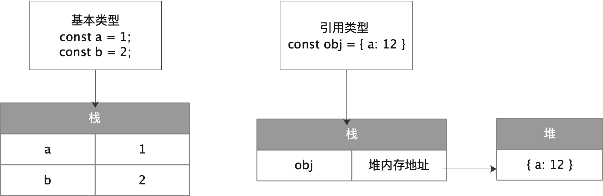

>js中数据类型分为两类：
- 基本数据类型：number、string、boolean、null、undefined，以及es6新增的symbol、bigint。
- 引用数据类型：对象（普通对象、数组、正则、Math、Date、函数）。
  
## 基本数据类型和引用数据类型的区别  
> 栈（stack）和堆（heap）：stack为自动分配的内存空间，它由系统自动释放；而heap则是动态分配的内存，大小也不一定会自动释放
- 基本数据类型（值类型）由于结构简单，数据大小确定，内存空间大小可以分配，它们可以直接保存在栈内存中。赋值的变量指向具体值。  
- 引用数据类型（引用类型）存放在堆内存中，所赋值的变量指向堆内存中的地址。所以当a、b两个引用类型指向同一地址时，修改一个，另一个也随之改变。  
  

### 浏览器中真的是这样吗？
以chrome v8引擎为例。  
1. 在函数作用域中，变量是基本类型的存在栈中。变量是引用类型存在堆中。
2. 在函数作用域中，如果形成闭包，不论是基本类型还是引用类型，都存在堆中，地址保存在函数的一个属性[[scope]]中。
3. 在全局作用域中，变量的值都存在堆中。可以这么理解：全局上下文中每一个函数都是闭包。

## 如何判断类型
>判断数据类型一般可以通过四种方法：typeof、instanceof、constructor、Object.prototype.toString.call。
```js
const num = 1;
const str = '';
const bool = true;
const nul = null;
const und = undefined;
const arr = [1,2];
const obj = {a: 1};
const fun = function () {};
```  

### typeof
```js
typeof num; // number
typeof str; // string
typeof bool; // boolean
typeof nul; // object
typeof und; // undefined
typeof arr; // object
typeof obj; // object
typeof fun; // function
```
typeof能准确判断基本类型，但对于引用类型就力不从心，可以看到对于null、arr、object都返回object。详细信息可以参考[typeof-mdn](https://developer.mozilla.org/zh-CN/docs/Web/JavaScript/Reference/Operators/typeof)。  

**那为什么`typeof null`为object呢？**  
JS类型值是存在32 BIT 单元里,32位有1-3位表示TYPE TAG,其它位表示真实值。  
表示object的标记位正好是低三位都是0。(000: object. The data is a reference to an object.)  
- 1：整数
- 010：浮点数
- 100：字符串
- 110：布尔值
- 000：对象
- null：所有机器码为0
- undefined：用2^-30整数表示  

而js里的Null 是机器码NULL空指针, (0x00 is most platforms).所以空指针引用 加上 对象标记还是0,最终体现的类型还是object..  
这也就是为什么Number(null)===0吧...

### instanceof  
instanceof运算符用来检测**构造函数的原型对象**，是否在某实例的**原型链**上。因此instanceof**检测的是原型**。通常用来判断A是否为B的实例`A instanceof B`。**因此instanceof无法判断基本数据类型。**
详情见[mdn instanceof](https://developer.mozilla.org/zh-CN/docs/Web/JavaScript/Reference/Operators/instanceof)。
```js
[] instanceof Array; // true
{} instanceof Object;// true
newDate() instanceof Date;// true
 
function Person(){};
newPerson() instanceof Person;
 
[] instanceof Object; // true
newDate() instanceof Object;// true
newPerson instanceof Object;// true
```
因此，instanceof 只能用来判断两个对象是否属于实例关系， 而不能判断一个对象实例具体属于哪种类型。  
**局限**：如果网页中包含多个框架，那实际上就存在两个以上不同的全局执行环境，从而存在两个以上不同版本的构造函数。如果你从一个框架向另一个框架传入一个数组，那么传入的数组与在第二个框架中原生创建的数组分别具有各自不同的构造函数。
```js
var iframe = document.createElement('iframe');
document.body.appendChild(iframe);
xArray = window.frames[0].Array;
var arr = new xArray(1,2,3); // [1,2,3]
arr instanceof Array; // false
```  

`a instanceof A`当a使用instanceof运算符，会调用构造器A的`[Symbol.hasInstance]`方法。  
`Symbol.hasInstance`用于判断某对象是否为某构造器的实例。因此你可以用它自定义 `instanceof` 操作符在某个类上的行为。  

```js
class PrimitiveNumber {
  static [Symbol.hasInstance](x) {
    return typeof x === 'number'
  }
}
console.log(111 instanceof PrimitiveNumber) // true

```
### constructor
当函数F被定义时，js引擎会为F加上prototype原型，原型对象上会有一个constructor属性，指向构造函数F。`f.prototype.constructor === f`
```js
str.constructor === String; // true
num.constructor === Number; // true
bol.constructor === Boolean; // true
arr.constructor === Array; // true
obj.constructor === Object; // true
fun.constructor === Function; // true
```
注意：
1. constructor是可以人为修改的。
2. 由于null和undefined是无效的对象，没有constructor属性，所以不能通过constructor属性判读。

### toString
toString() 是 Object 的原型方法，调用该方法，默认返回当前对象的 [[Class]] 。这是一个内部属性，其格式为 [object Xxx] ，其中 Xxx 就是对象的类型。我们一般配合call或apply使用`Object.prototype.toString.call()`。
```js
Object.prototype.toString.call('') ;   // [object String]
Object.prototype.toString.call(1) ;    // [object Number]
Object.prototype.toString.call(true) ; // [object Boolean]
Object.prototype.toString.call(Symbol()); //[object Symbol]
Object.prototype.toString.call(undefined) ; // [object Undefined]
Object.prototype.toString.call(null) ; // [object Null]
Object.prototype.toString.call(new Function()) ; // [object Function]
Object.prototype.toString.call(new Date()) ; // [object Date]
Object.prototype.toString.call([]) ; // [object Array]
Object.prototype.toString.call(new RegExp()) ; // [object RegExp]
Object.prototype.toString.call(new Error()) ; // [object Error]
Object.prototype.toString.call(document) ; // [object HTMLDocument]
Object.prototype.toString.call(window) ; //[object global] window 是全局对象 global 的引用
```
## 类型间的隐式转换
很多博文总结 == 的转换规则都是按照 ES 标准文档中的定义来总结的，这很标准也很正确，但是太繁琐了，萌新们初学时总是很难记住。  
其实大致简单总结下规则：  
1. 两个操作数的数据类型相同，== 直接进行判断；数据类型不同，则要对操作数进行类型转换（大多数的面试题既然考 ==，本质上就是考类型转换）
2. 判断操作数的数据类型：
-  如果都是原始类型(string/number/boolean，除去特殊值null/undefined/NaN)，两者都转为数值进行判断；
-  特殊值的话，null/undefied/NaN 和任何值(不包括自身) == 都为 false；null 和 undefined == 为 true，分别与自身 == 也为true；NaN 与自身 == 为 false；
-  原始类型和引用类型进行比较，原始类型是数值引用类型转为数值，原始类型是字符串引用类型转为字符串，原始类型是布尔值两者都转为数值；
-  引用类型和引用类型进行比较，比较的是内存地址。

例子：`[ ] == ![ ]`  
[ ] == ![ ] 的判断本质上是原始类型和引用类型的判断，一元运算符 ! 优先级高于二元运算符 ==，实际 == 判断时表达式已经转为 [ ] == false，然后 == 导致的隐式转换，二者都转为数值 0 == 0 就返回 true 了。  

### 对象转为对应的原始值  
对象转为原始值，调用顺序如下：  
1. 调用内置函数`[Symbol.toPrimitive]()`
2. 转为number先调用`valueOf()`，再调用`toString()`
3. 转为string先调用`toString()`，再调用`valueOf()`
4. 若对象为Date，先调用`toString()`，再调用`valueOf()`

```js
var obj = {
  value: 3,
  [Symbol.toPrimitive]() {
    return 6
  },
  valueOf() {
    return 4;
  },
  toString() {
    return '5'
  }  
}
console.log(obj + 1); // 输出7
```

例子：如何让`(a==1 && a==2)`条件成立？  
```js
var a = {
  value: 0,
  valueOf() {
    return ++ this.value
  }
}
console.log(a==1 && a==2) // true
```